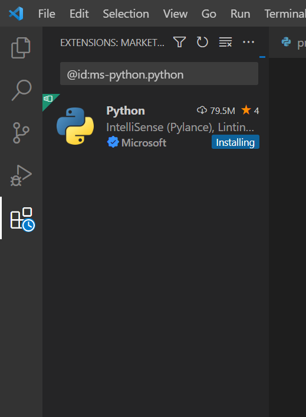
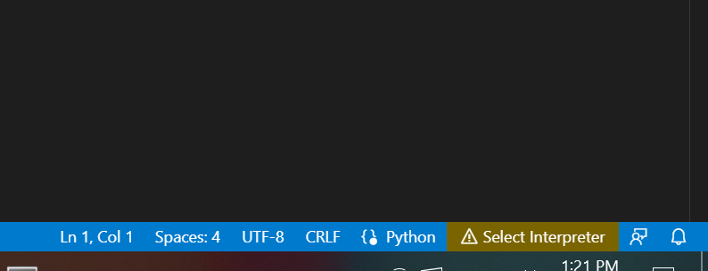
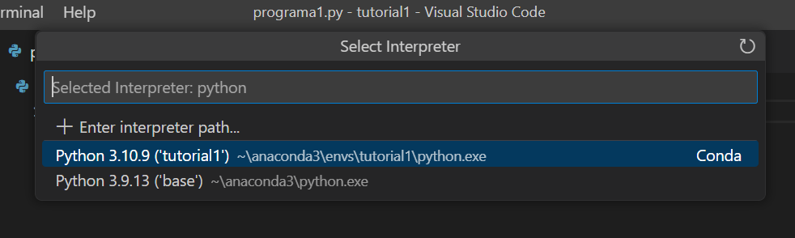
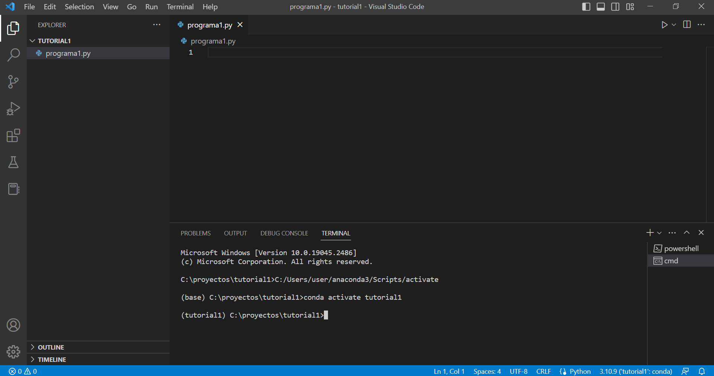
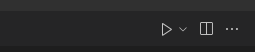

# ingar-python-starter
Proyecto ejemplo para iniciarse en programación en python

## Software requerido

- [anaconda python](https://anaconda.com/products/distribution)
- [git](https://git-scm.com)
- [vscode (Visual Studio Code)](https://code.visualstudio.com)

Descargar y realizar la instalación con todos los valores por defecto.

## Otras tecnologías

- Esta documentación está hecha con `Markdown`, que es un lenguaje simple para generar documentos con un formato mínimo.
- Van a necesitar una cuenta personal en `GitHub` (o `GitLab` o `Bitbucket`). Esto es gratis.

## Creando un proyecto (tutorial1)

- El código se organiza como `proyecto`. Un `proyecto` no es más que una carpeta específica donde vamos a poner el código con la documentación y el archivo `README.md` donde vamos a poner una breve documentación del proyecto, así como también como ejecutarlo.
- Para esto vamos a generar un `environment` en anaconda con las librerías necesarias para ejecutar ese proyecto.
- La idea es generar un entorno que pueda ser reproducible por otra persona sin mayores conflictos.

1. Supongamos que queremos crear un proyecto basado en este ejemplo utilizando la librería `scikit-learn`: [Plot randomly generated multilabel dataset](
https://scikit-learn.org/stable/auto_examples/datasets/plot_random_multilabel_dataset.html#sphx-glr-auto-examples-datasets-plot-random-multilabel-dataset-py)
2. Creamos un entorno de python que vamos a utilizar para este proyecto. Abrimos `Anaconda Prompt` y creamos un entorno que se llame `tutorial1` con la versión de python 3.10.
```bash
conda create --name tutorial1 python=3.10
```
3. Creamos la carpeta `C:\proyectos\tutorial1`
4. Abrimos `vscode` -> `Open Folder` -> seleccionamos la carpeta recién creada
5. Creamos un archivo llamado `programa1.py`
6. Inmediatamente después de crear el archivo, nos va a preguntar si queremos instalar la extensión para Python. Seleccionamos Install.
7. vscode tiene una barra lateral izquierda donde vamos a tener diferentes secciones (Explorer, Search, Source Control, Run & Debug, Extensions).

Volvemos al Explorer (primer ícono) y abrimos el archivo `programa1.py`.
8. En la esquina inferior derecha, vamos a ver un botón que dice `Select Interpreter`.

Cliqueamos ahí y seleccionamos el entorno creado `tutorial1`. Esto se hace una sola vez para todo el proyecto.

9. Hay un pequeño ajuste que hay que hacer para que vscode funcione bien con ananconda python.
Realizar lo siguiente dentro de VS Code:
- opening the command palette (Control-Shift-P)
- search for Terminal: Select Default Profile
- select Command Prompt
10. Luego, ir al menú `Terminal` -> `New terminal`. Deberían ver algo parecido a esto.

El prompt debería mostrar al principio entre paréntesis el environment de python con el que están trabajando.
11. Pasando al tutorial, vamos a instalar las dependencias en el entorno. En este caso, tenemos que instalar las librerías `scikit-learn` y `matplotlib`.
Ejecutamos:
```bash
pip install scikit-learn
pip install matplotlib
```
Así se instalan todas las librerías.

12. Copiamos el código de [Plot randomly generated multilabel dataset](
https://scikit-learn.org/stable/auto_examples/datasets/plot_random_multilabel_dataset.html#sphx-glr-auto-examples-datasets-plot-random-multilabel-dataset-py) y lo pegamos en el archivo 'programa1.py'.

13. Ejecutamos haciendo click en el ícono `Run Python File`


14. Listo. Cualquier otro archivo `.py` que se cree en la carpeta esa va a utilizar el mismo `environment`.

## Siguientes pasos (TODO)
- Subir proyecto a gitlab
- Crear proyecto streamlit
- Debuggear python code
- Ejecutar Jupyter Notebooks
- Utilizar proyecto existente con requirements.txt

